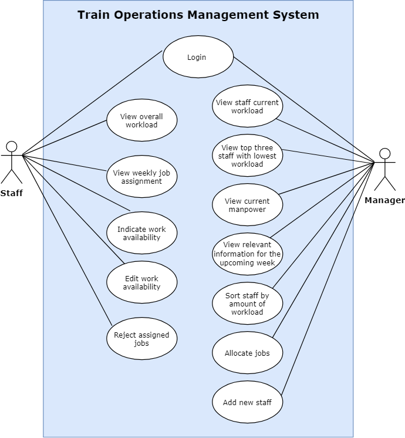

# ICT2101-2201-Team1 - Train Operations Management System

## Team Member Roles

| Member    | Role(s) 	|
| ---------- | ------------------------- |
| Christabelle    | Team Lead/Full Stack Developer |
| Gavin    | Tech Lead(Architect)/Full Stack Developer |
| Yong Chong    | Front End Developer/UI&UX Designerr |
| Irfaan    | Back End Developer/QA Engineer |

## Introduction
### Scope
The scope of this project is a web application that supports the company’s operational system for train services. Managers will be able to have an overview of the company’s manpower strength and allocate work. Staff will be able to view their job assignment information and inform managers of their availability.
 
 
The system will be based on a relational database with work management and staff management functions. We will have a database server supporting all managers and staff and a user-friendly interface.

### Background
The challenge of balancing an employee's workload is constant, and it can be a touchy subject at work. Companies frequently search for technologies that can simplify their task management because work-life balance is a cycle and there is always a desire to improve it and make the workplace more hospitable and appealing.
 
 
The Client has therefore determined that a workload management system based on the Web would be an instructive approach to get an overview of the company's labor strength at all time and to obtain more detailed information on staff availability and engagement.
 
 
The solution is expected to provide an interactive way for employees to view their job assignments, and indicate their availabilities. The adminstrative staff should also be able to visualize the manpower availability at a glance.
 
 
Work allocation is assigned weekly on Mondays in the train operation section of a train company. Every Thursday of the week, the planning for workload distribution will begin. As a result, every Wednesday, all employee availabilities must be entered into the system in order to be taken into account during planning. Requests would be handled on a case-by-case basis if employees missed the weekly deadline.
 
 
The length and route of the train affect the weekly roster. Five Pendolino trains are being operated by the company between Singapore and Kuala Lumpur. One way travel time on the route is roughly four hours. There are eight stops along the route, and the service typically stops at each one for ten minutes or so. Throughout the trip, there should always be at least one engine driver at the locomotive. One train conductor should be present on board for all services. Every two passenger carriages will also have a cleaner and an auxiliary conductor assigned to them. There would typically be seven to thirteen passenger carriages on the train.
 
 
The management will arrange workers so that they do not have to travel between routes and trains do not remain stopped for more than three hours. Every day, the service runs bidirectionally every two hours from each end. The first train leaves at 5.30 a.m., while the last one leaves at 9.30 p.m.
 
 
The engine driver is only permitted to run the locomotive for a maximum of two hours at a time by law. As a result, while giving job tasks, the management must take this into account.

## Frameworks
| Application    | Framework(s) 	|
| ---------- | ------------------------- |
| Frontend application   | React.js / Next.js	|
| Backend application    | Express.js	|
| Database management system   | PostgreSQL	|

## System Architecture Diagram

## Use Case Model

## Requirements 
### UI Requirements
- Login Screen
- Employee:
	- Landing page that shows his current job assignments, working hours, engaged assignments/ upcoming assignments
	- Page to Inform system of availalbities (for upcoming roster), they can indicate up to 1 month earlier
	- Page to inform manager that you cmi (for engaged/existing roster)
- Manager:
	- Landing page that visualize manpower availability up to 1 month earlier
	- Job assignment page for employees (upcoming and engaged roster)
	- Employee workload and availability (status)

### Functional Requirements
- The system should allow users to log into their account by entering their username and password.
- The system should allow users to log out of their account.
- The manager should be able to view all staff’s current workload on the landing page.
- The manager should be able to view the total manpower on the landing page.
- The manager should be able to view the top three staff with the lowest workload on the landing page.
- The manager should be able to view the workload assigned, staff’s preferred time slot, staff’s location, and availability for the week in the staff availability table on the job allocation page.
- The manager should be able to sort staff by the amount of workload assigned in the staff availability table on the job allocation page.
- The manager should be able to view staff exceeding 40 hours of work highlighted in red in the staff availability table on the job allocation page.
- The manager should be able to allocate jobs to staff for one week at a time in the staff availability table on the job allocation page.
- The manager should be able to add new staff to the system.
- Staff should be able to view their weekly job assignments on their landing page.
- Staff should be able to view their overall workload for the month on their landing page.
- Staff should be able to indicate their work availability up to 1 month in advance of the job on the calendar page.
- Staff should be able to edit their work availability from the following Thursday up to one month on the calendar page.
- Staff should be able to reject the jobs assigned to them by the manager on the calendar page.

### Non Functional Requirements
- The system shall be based in the form of a web application. It will consist of a frontend application to display and input data for the user, and a backend application to process it. The two applications will connect to each other using REST service calls.
- The manager should take no more than 2 hours to complete job allocation for the week.
#### Performance Requirements
- A REST service call must respond within 3 seconds.
- The system should be able to support up to 100 concurrent users.
- The system should be available for end users 95% of the time.

#### Safety and Security Requirements
- After 3 unsuccessful login attempts, the system will lock an account to protect a user's information from potential hackers.
- All Personally Identifiable Information (PII) will be encrypted.
- The system shall be secured using HTTPS protocol with an SSL certificate.
- The application should not store hard coded sensitive information.

#### Other requirements
- The system should be accessible from Google Chrome, Mozilla Firefox, Microsoft Edge, Brave and Safari.
- The system should be responsive, catering to any devices with any resolution.
- The system shall meet the Web Content Accessibility Guidelines WCAG 2.1.
- Username should not be NRIC due to PDPA.

#### Prototype Walkthrough
Link to YouTube: https://youtu.be/nXuDMSXQkWA
